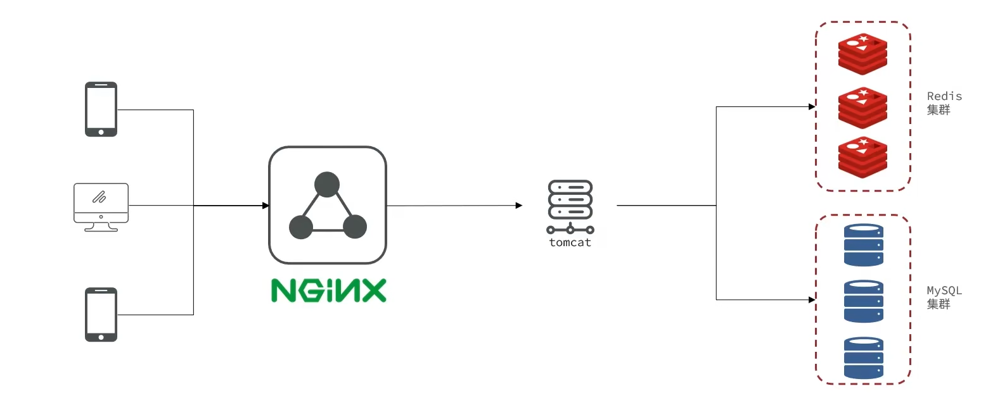
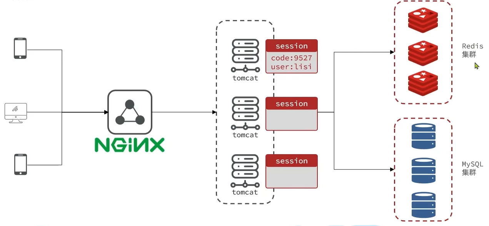

<div align="center">
<h3>基于 Spring Boot 的本地生活点评后端项目</h3>
</div>


<div align="center">


</div>
## 项目简介

// TODO

## 项目架构

单机架构



集群架构



## 如何使用本项目

克隆完整项目

```git
git clone https://github.com/t1ostang/stdp.git
```

在使用本项目前，请在MySQL中**新建‘stdp’数据库**，然后执行sql文件夹下的sql文件，**生成对应的表**

- **方法一：**

下载源码，导入Idea，配置运行`src`下的`DianPingApplication`即可

> 注意：因为隐藏了配置文件，所以需要修改各个模块下的application.yml配置文件才可以正常启动

- **方法二：**

使用`java -jar` 命令运行`src`模块下的 `stdp-1.0-SNAPSHOT.jar` 即可


## 常见问题
启动项目时，控制台可能会一直报错:
```
NOGROUP No such key 'stream.orders' or consumer group 'g1' in XREADGROUP with GROUP option
```
这是因为我们完整版代码会尝试访问Redis，连接Redis的Stream。请先在Redis运行一下命令：
```text
XGROUP CREATE stream.orders g1 $ MKSTREAM
```
